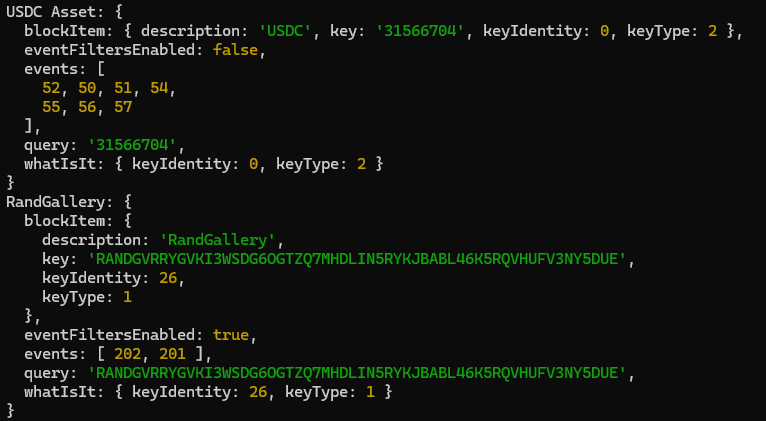

<div align="center">
 <a href="https://blockstalker.io">
  <picture>
    
 </a>
</div>

# Hello BlockStalker (Javascript Demo App)

Hello BlockStalker is a simple [BlockStalker.IO](https://blockstalker.io) SDK demo app, which leverages the `@blockstalker/client-js` library to facilitate communication with the BlockStalker.IO API.  Use it to follow NFTs, Accounts, Apps... anything on Algorand MainNet.

<div align="center">
 <a href="https://blockstalker.io">
  <picture>
    
 </a>
</div>


## Requirements

1. NodeJS
1. An API Key from your [BlockStalker subscription](https://blockstalker.io/account)

## Getting Started

1. Download
```bash
git clone https://github.com/BlockStalker/hello-blockstalker-js.git
```

2. Update your [BlockStalker API Key](https://blockstalker.io/account) in `index.js` (or set in `.env`)

```javascript
const local_apiKey = 'YOUR_API_KEY_HERE';
```

3. Run
```javascript
npm install
npm start
```

## License

MIT License; we welcome collaboration and contribution from the community.
